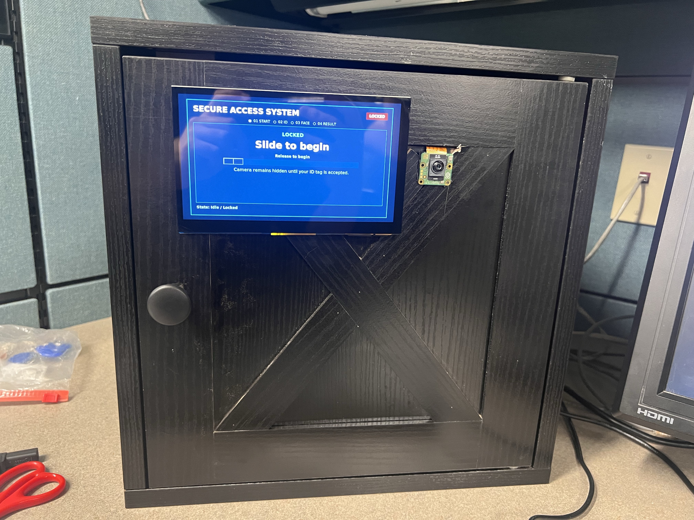
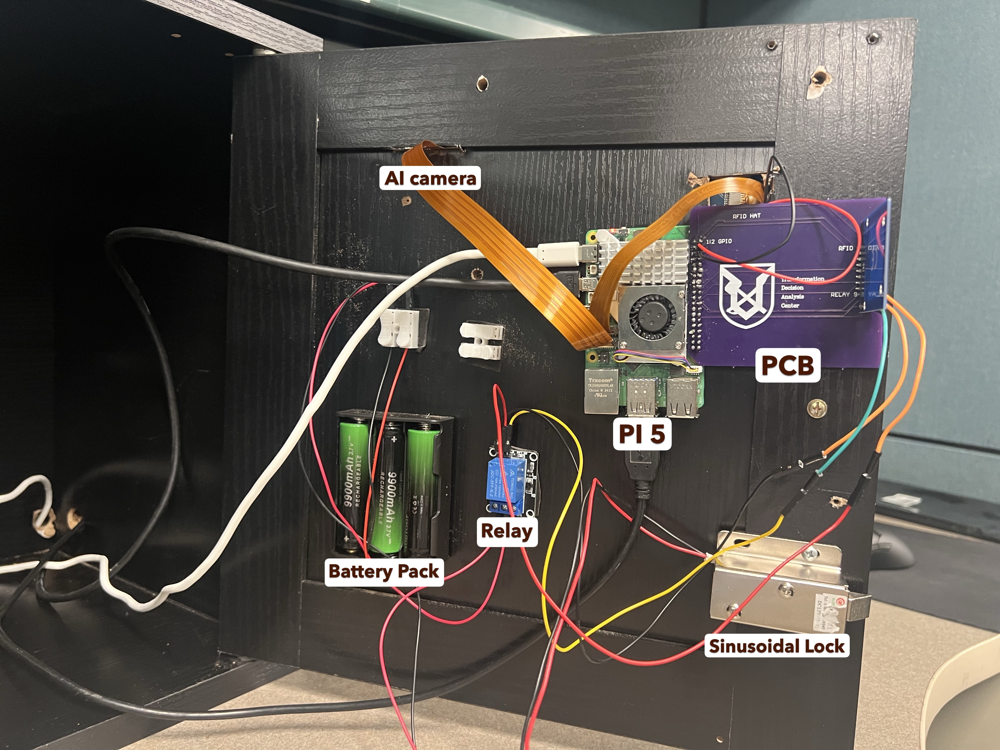
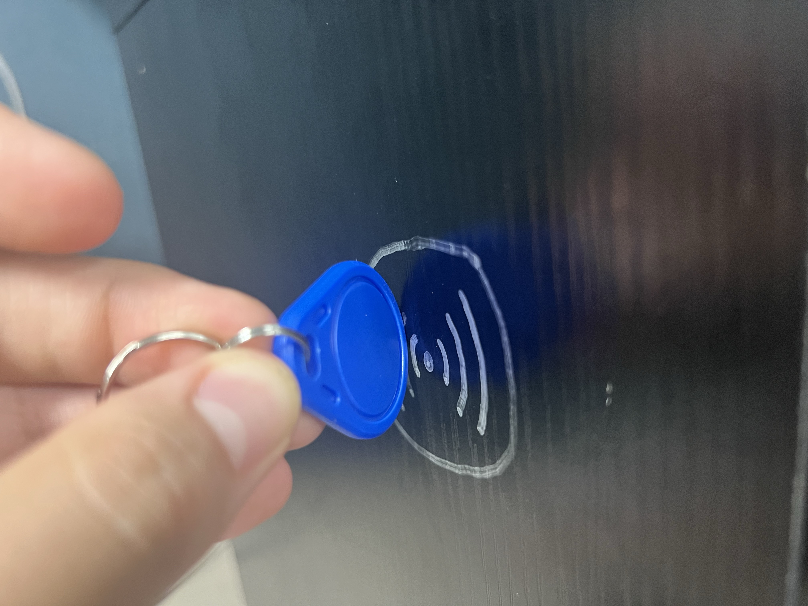
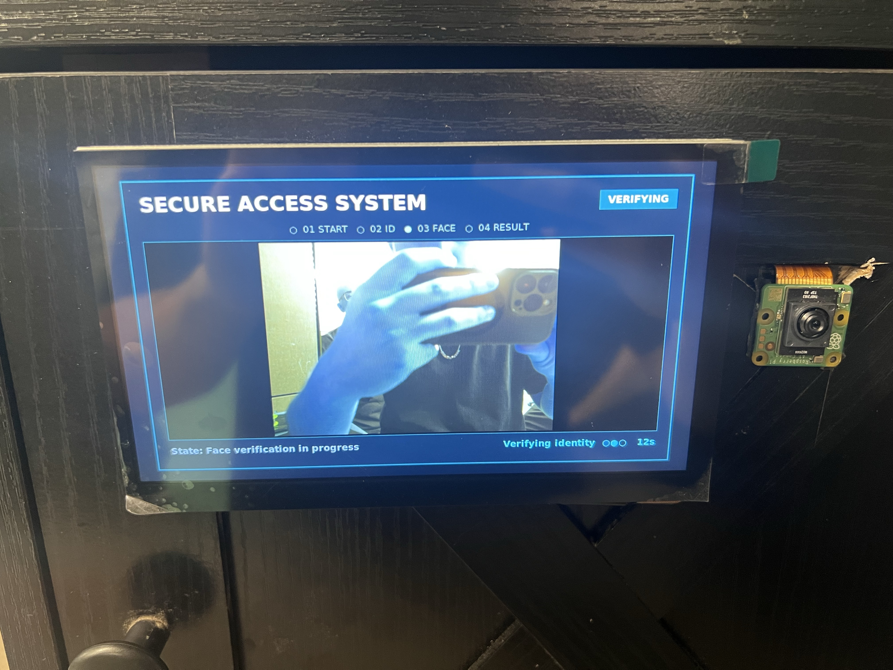
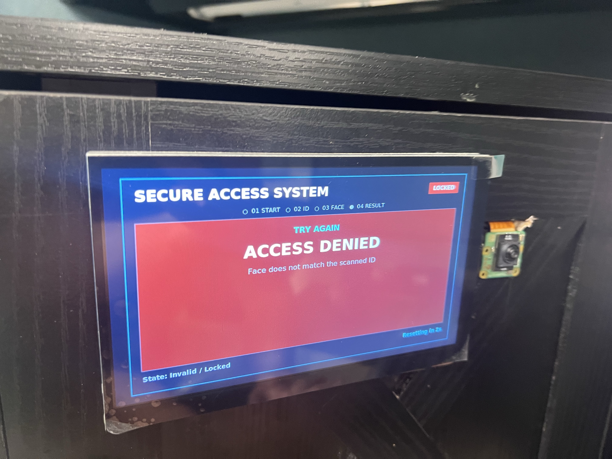

# Secure Access System — RFID + Facial Recognition Door Lock

A two-factor authentication door lock system built on a Raspberry Pi 5, combining **RFID card verification** with **AI-based facial recognition** to control a relay-driven 12V solenoid lock. Built as a senior capstone project.



## Features

- **Two-factor authentication** — a valid RFID tag must be scanned *and* the correct enrolled face verified within a 15-second window before the door unlocks
- **Touchscreen GUI** — a Tkinter-based public interface walks users through Idle → Scan ID → Face Verification → Result
- **Admin Control Panel** — a separate interface for enrolling new users (RFID + face capture), enabling/disabling/removing users, and reviewing the security log
- **Audit logging** — every access attempt (granted, denied, unknown tag, timeout) is logged with a timestamp
- **Anomaly detection** — learns each user's typical access times and flags unusual-time entries for review
- **Custom PCB HAT** — designed in Altium, combining the RFID reader and relay connections on a single board that stacks onto the Pi's GPIO header

## Hardware

| Component | Role |
|---|---|
| Raspberry Pi 5 | Main processor running the authentication software |
| RC522 RFID Reader | Reads RFID tags over SPI |
| Raspberry Pi AI Camera (IMX500) | Captures live video for facial recognition |
| Custom PCB HAT | Carries RFID + relay wiring, stacks onto the Pi's 40-pin header |
| Relay Module | Switches power to the solenoid lock |
| 12V Solenoid Lock | Physical locking mechanism |

## Inside the Enclosure



## How It Works

1. **Scan your RFID tag** — the system identifies which user is claiming access and opens a 15-second window for the second factor.

   

2. **Face verification** — the camera activates and checks the live face against the enrolled user tied to that tag.

   

3. **Access granted** — if the tag and face match, the relay fires and the solenoid unlocks.

   

4. **Access denied** — if the face doesn't match the scanned tag, access is denied and the system resets.

   

## Demo Videos

> Note: these are `.mov` files. GitHub will play them inline on the repo page, but if a video doesn't preview in your browser, click **"View raw"** to download and play it locally.

- [Scanning the RFID tag](media/scanning_RFID_vid.mov)
- [Face recognition in action](media/Face_Reg_vid.mov)
- [Solenoid lock unlocking](media/lock_unlocking_vid.mov)

## Software

- **Language:** Python
- **Key libraries:** `picamera2`, `face_recognition`, `opencv-python`, `lgpio`, `mfrc522`, `tkinter`
- **State machine:** `IDLE → WAIT_RFID → FACE_AUTH → SUCCESS / DENIED`
- **Data storage:** JSON user database, CSV audit log

## Getting Started

```bash
# Clone the repo
git clone https://github.com/IsaacPerez003/<repo-name>.git
cd <repo-name>

# Install dependencies
pip install -r requirements.txt --break-system-packages

# Run the system (on a Raspberry Pi 5 with the hardware connected)
python3 mfa_ai_system.py
```

> This project is built for Raspberry Pi 5 hardware (RC522 RFID reader, IMX500 AI Camera, relay, solenoid lock) and will not run standalone on a regular computer without that hardware attached.

## Team

- **Julian** — Facial recognition module
- **Luis** — Hardware integration & system testing
- **Isaac** — RFID module, PCB design, GUI, logging system

## License

This project is licensed under the MIT License — see the [LICENSE](LICENSE) file for details.
