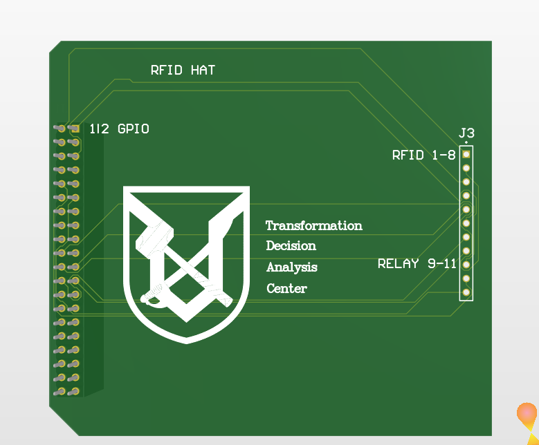
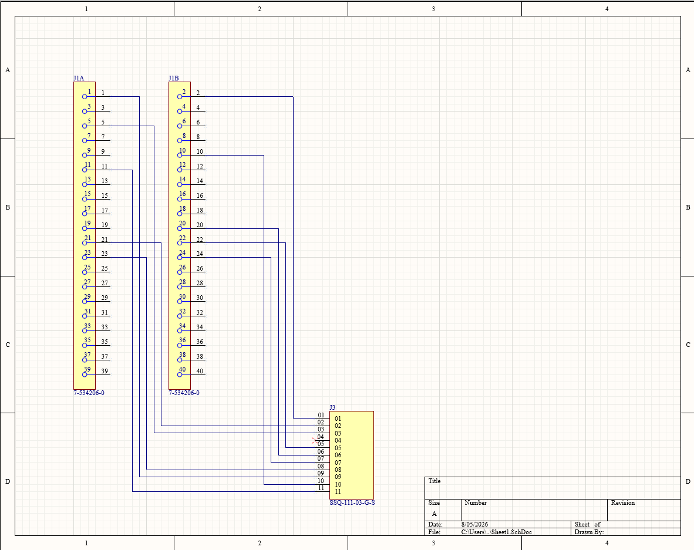
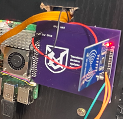

# PCB — Custom RFID HAT

The system uses a custom-designed PCB, built as a HAT (Hardware Attached on Top) that stacks directly onto the Raspberry Pi 5's 40-pin GPIO header. It combines the RC522 RFID reader connections and the relay control lines onto a single board, designed in Altium Designer and fabricated through OSHPark.

## 3D Render

The full board layout, including the RFID HAT silkscreen, the 40-pin GPIO header footprint (J1), and the RFID/relay connector (J3) at the outer edge of the board.

## Schematic

Shows the RC522 and relay wired to their respective GPIO pins through connector J3, along with the 40-pin Pi header (J1) footprint.

## Populated Board

The fully populated board mounted onto the Raspberry Pi 5, with the RC522 reader and relay wired in through J3.

## Design Notes

- **HAT form factor**: The board stacks directly onto the Pi's 40-pin GPIO header (J1), keeping the wiring self-contained rather than relying on loose jumper wires.
- **Edge placement of J3**: The RFID connector is positioned at the outer edge of the board rather than centered near the GPIO header. This keeps the RFID antenna as close as possible to the enclosure wall facing the door, maximizing read range through the wood housing.
- **Mirrored footprint**: The J1 GPIO header footprint is placed on the bottom layer, which mirrors the pin order. Every adjacent pin pair swaps position relative to the Pi's physical header (J1 pin 1 = Pi pin 2, J1 pin 2 = Pi pin 1, etc.), and all routing accounts for this offset.
- **Single connector for two subsystems**: J3 is an 11-pin connector carrying both the RC522 (pins 1–8) and the relay (pins 9–11), with pin 4 (IRQ) intentionally left not connected.

## J3 Pinout

| J3 Pin | Connects to (Pi physical pin) | Function |
|---|---|---|
| 1 | Pin 1 | RC522 VCC (3.3V) |
| 2 | Pin 22 | RC522 RST |
| 3 | Pin 6 | GND |
| 4 | — | IRQ (Not Connected) |
| 5 | Pin 21 | RC522 MISO |
| 6 | Pin 19 | RC522 MOSI |
| 7 | Pin 23 | RC522 SCK |
| 8 | Pin 24 | RC522 SDA |
| 9 | Pin 2 | Relay VCC (5V) |
| 10 | Pin 9 | Relay GND |
| 11 | Pin 12 | Relay IN (GPIO18) |

## Fabrication

- **Design tool**: Altium Designer
- **Manufacturer**: OSHPark
- **Connectors used**: SSW-120-02-T-D-RA (40-pin 2x20, bottom layer, mirrored) for the Pi GPIO header; SSQ-111-03-G-S (11-pin single-row) for the RFID + relay connector (J3)
- ## Fabrication Files

- [Gerber files (.zip)](PCB_DESIGN.zip) — ready to submit to a PCB manufacturer
